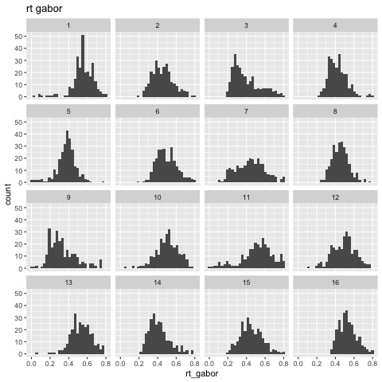
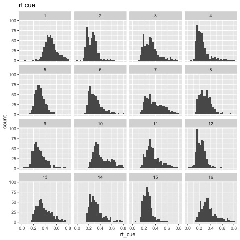
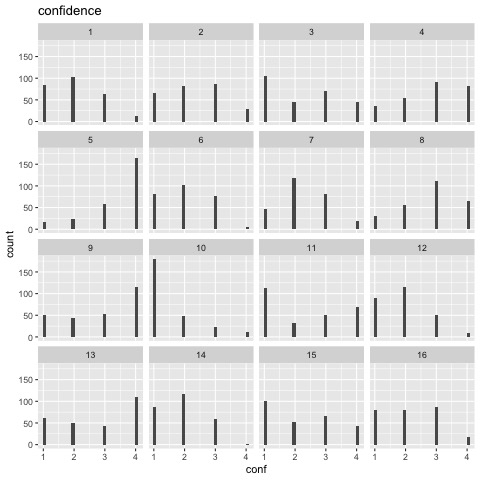
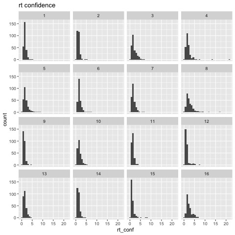
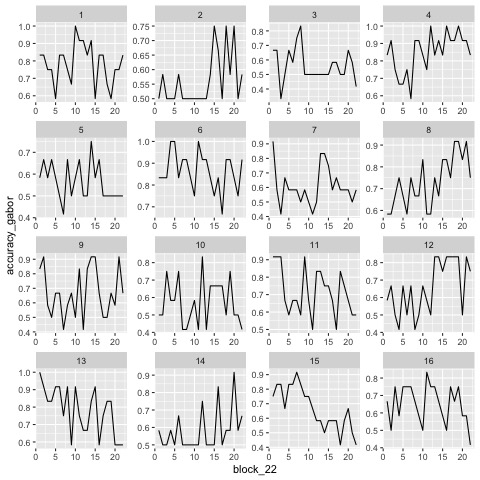
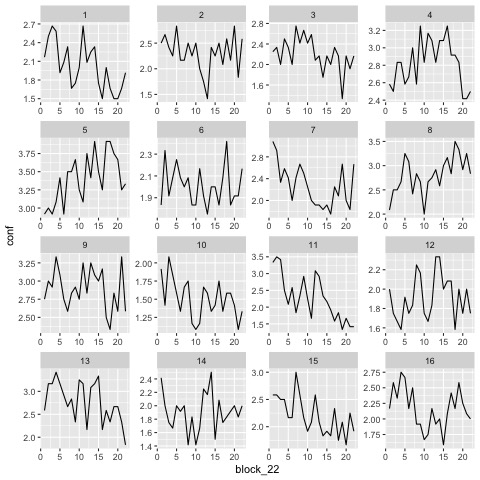

#+title: Motor Gabor
#+date:
#+author:

:options_LaTex:
#+options: toc:nil title:t date:t
#+LATEX_HEADER: \RequirePackage[utf8]{inputenc}
#+LATEX_HEADER: \graphicspath{{figures/}}
#+LATEX_HEADER: \usepackage{hyperref}
#+LATEX_HEADER: \hypersetup{
#+LATEX_HEADER:     colorlinks,%
#+LATEX_HEADER:     citecolor=black,%
#+LATEX_HEADER:     filecolor=black,%
#+LATEX_HEADER:     linkcolor=blue,%
#+LATEX_HEADER:     urlcolor=black
#+LATEX_HEADER: }
#+LATEX_HEADER: \usepackage{hyperref}
#+LATEX_HEADER: \usepackage[french]{babel}
#+LATEX_HEADER: \usepackage[style = apa]{biblatex}
#+LATEX_HEADER: \DeclareLanguageMapping{english}{english-apa}
#+LATEX_HEADER: \newcommand\poscite[1]{\citeauthor{#1}'s (\citeyear{#1})}
#+LATEX_HEADER: \addbibresource{~/thib/prjects/tools/bibpsy.bib}
#+LATEX_HEADER: \usepackage[top=2cm,bottom=2.2cm,left=3cm,right=3cm]{geometry}
:END:

:Options_R:
#+property: :session *R*
#+property: header-args:R :exports results
#+property: header-args:R :eval never-export
#+property: header-args:R+ :tangle yes
#+property: header-args:R+ :session
#+property: header-args:R+ :results output 
:end:

# #+PANDOC_OPTIONS: self-contained:t

# clean output
#+begin_src emacs-lisp :exports none
  ; (org-babel-map-src-blocks nil (org-babel-remove-result))
#+end_src

* Preparation

First, a bit of data cleaning and contrasts definitions.

#+BEGIN_SRC R  :results none  :tangle yes  :session :exports code 
  rm(list=ls(all=TRUE))  ## efface les données
  source('~/thib/projects/tools/R_lib.r')
  setwd('~/thib/projects/motor_gabor/data/AG_data/')
  load('data_final.rda')

  data_complete <- data %>%
    mutate(block_22 = rep(sort(rep(1:22,36) , decreasing = FALSE),16)) %>%
    mutate(rt_gabor = ifelse(rt_gabor <0, NA, rt_gabor)) %>%
    mutate(rt_cue = ifelse(rt_cue <0, NA, rt_cue)) %>%
    mutate(rt_conf = ifelse(rt_conf <0, NA, rt_conf)) %>%
    mutate(conf = ifelse(conf <0, NA, conf)) %>%
    mutate(accuracy_cue = ifelse(accuracy_cue <0, NA, accuracy_cue)) %>%
    mutate(accuracy_gabor = ifelse(accuracy_gabor <0, NA, accuracy_gabor)) %>%
    mutate(expected_gabor = ifelse(expected_gabor <0, NA, expected_gabor)) %>%
    mutate(pressed_gabor = ifelse(pressed_gabor <0, NA, pressed_gabor)) %>%
    mutate(gabor.contrast = ifelse(gabor.contrast <0, NA, gabor.contrast)) %>%
    mutate(pressed_cue = ifelse(pressed_cue =="-1", NA, pressed_cue)) %>%
    mutate(expected_cue = ifelse(expected_cue =="-1", NA, expected_cue)) %>%
    mutate(congruency = ifelse(congruency =="none", NA, congruency)) %>%
    mutate(effector_order = case_when(effector_order == 'feet2' | effector_order == 'hand1'  ~ 'hand1',
				      effector_order == 'hand2' | effector_order == 'feet1' ~ 'feet1')) %>%
      select(-c(trial_start_time_rel2bloc, bloc_start_time_rel2exp, exp_start_date,  pressed_conf))

  data <- data_complete %>%
      filter(!is.na(rt_gabor))

  ## define contrasts
  data$acc_gabor_num <- data$accuracy_gabor ## on garde la variable 0/1 pour l'analyse de accuracy
  data$accuracy_gabor <- as.factor(data$accuracy_gabor)
  contrasts(data$accuracy_gabor) <- - contr.sum(2) ## erreur: -1; correct: 1
  data$acc_cue_num <- data$accuracy_cue
  data$effector <- as.factor(data$effector)
  contrasts(data$effector) <-  -contr.sum(2) ## feet: -1; hand: 1
  data$condition <- as.factor(data$condition)
  data$effector_order <- as.factor(data$effector_order)
  contrasts(data$effector_order) <-  contr.sum(2) ## hand1: -1; feet: 1
  data$congruency <- as.factor(data$congruency)
  contrasts(data$congruency) <-  contr.sum(2) ## incongruent: -1; congruent: 1
#+END_SRC

* Descriptive statistics

#+BEGIN_SRC R :results value html :exports results
  d1 <- data_complete %>%
    group_by(subject_id) %>%
    filter(effector_order == 'hand1') %>%
    summarise(accuracy_gabor = mean(accuracy_gabor, na.rm = TRUE),
	      accuracy_cue = mean(accuracy_cue, na.rm=TRUE),
	      conf = mean(conf, na.rm=TRUE),
	      rt_gabor = mean(rt_gabor, na.rm=TRUE),
	      rt_cue = mean(rt_cue, na.rm=TRUE))
  print(xtable(d1), type = "html", caption = "Hands first", caption.placement = 'top')
#+END_SRC

#+RESULTS:
#+BEGIN_EXPORT html
<!-- html table generated in R 4.0.2 by xtable 1.8-4 package -->
<!-- Thu Apr 29 12:53:54 2021 -->
<table border=1>
<tr> <th>  </th> <th> subject_id </th> <th> accuracy_gabor </th> <th> accuracy_cue </th> <th> conf </th> <th> rt_gabor </th> <th> rt_cue </th>  </tr>
  <tr> <td align="right"> 1 </td> <td align="right">   1 </td> <td align="right"> 0.78 </td> <td align="right"> 0.96 </td> <td align="right"> 2.02 </td> <td align="right"> 0.55 </td> <td align="right"> 0.50 </td> </tr>
  <tr> <td align="right"> 2 </td> <td align="right">   3 </td> <td align="right"> 0.56 </td> <td align="right"> 0.97 </td> <td align="right"> 2.20 </td> <td align="right"> 0.40 </td> <td align="right"> 0.32 </td> </tr>
  <tr> <td align="right"> 3 </td> <td align="right">   5 </td> <td align="right"> 0.56 </td> <td align="right"> 0.99 </td> <td align="right"> 3.41 </td> <td align="right"> 0.38 </td> <td align="right"> 0.32 </td> </tr>
  <tr> <td align="right"> 4 </td> <td align="right">   7 </td> <td align="right"> 0.61 </td> <td align="right"> 0.96 </td> <td align="right"> 2.27 </td> <td align="right"> 0.44 </td> <td align="right"> 0.38 </td> </tr>
  <tr> <td align="right"> 5 </td> <td align="right">   9 </td> <td align="right"> 0.67 </td> <td align="right"> 0.96 </td> <td align="right"> 2.89 </td> <td align="right"> 0.33 </td> <td align="right"> 0.30 </td> </tr>
  <tr> <td align="right"> 6 </td> <td align="right">  11 </td> <td align="right"> 0.72 </td> <td align="right"> 0.95 </td> <td align="right"> 2.28 </td> <td align="right"> 0.51 </td> <td align="right"> 0.36 </td> </tr>
  <tr> <td align="right"> 7 </td> <td align="right">  13 </td> <td align="right"> 0.78 </td> <td align="right"> 0.92 </td> <td align="right"> 2.77 </td> <td align="right"> 0.53 </td> <td align="right"> 0.38 </td> </tr>
  <tr> <td align="right"> 8 </td> <td align="right">  15 </td> <td align="right"> 0.67 </td> <td align="right"> 0.96 </td> <td align="right"> 2.20 </td> <td align="right"> 0.45 </td> <td align="right"> 0.26 </td> </tr>
   </table>
#+END_EXPORT

Feet first:

#+BEGIN_SRC R :results value html :exports results
  d2 <- data_complete %>%
    group_by(subject_id) %>%
    filter(effector_order == 'feet1') %>%
    summarise(accuracy_gabor = mean(accuracy_gabor, na.rm = TRUE),
	      accuracy_cue = mean(accuracy_cue, na.rm=TRUE),
	      conf = mean(conf, na.rm=TRUE),
	      rt_gabor = mean(rt_gabor, na.rm=TRUE),
	      rt_cue = mean(rt_cue, na.rm=TRUE))
  print(xtable(d2), type = "html", caption = "Feet first", caption.placement = 'top')
#+END_SRC

#+RESULTS:
#+BEGIN_EXPORT html
<!-- html table generated in R 4.0.2 by xtable 1.8-4 package -->
<!-- Thu Apr 29 12:54:21 2021 -->
<table border=1>
<tr> <th>  </th> <th> subject_id </th> <th> accuracy_gabor </th> <th> accuracy_cue </th> <th> conf </th> <th> rt_gabor </th> <th> rt_cue </th>  </tr>
  <tr> <td align="right"> 1 </td> <td align="right">   2 </td> <td align="right"> 0.56 </td> <td align="right"> 0.99 </td> <td align="right"> 2.30 </td> <td align="right"> 0.45 </td> <td align="right"> 0.26 </td> </tr>
  <tr> <td align="right"> 2 </td> <td align="right">   4 </td> <td align="right"> 0.85 </td> <td align="right"> 0.98 </td> <td align="right"> 2.83 </td> <td align="right"> 0.42 </td> <td align="right"> 0.25 </td> </tr>
  <tr> <td align="right"> 3 </td> <td align="right">   6 </td> <td align="right"> 0.86 </td> <td align="right"> 0.96 </td> <td align="right"> 2.01 </td> <td align="right"> 0.50 </td> <td align="right"> 0.32 </td> </tr>
  <tr> <td align="right"> 4 </td> <td align="right">   8 </td> <td align="right"> 0.73 </td> <td align="right"> 0.96 </td> <td align="right"> 2.81 </td> <td align="right"> 0.45 </td> <td align="right"> 0.31 </td> </tr>
  <tr> <td align="right"> 5 </td> <td align="right">  10 </td> <td align="right"> 0.57 </td> <td align="right"> 0.95 </td> <td align="right"> 1.50 </td> <td align="right"> 0.50 </td> <td align="right"> 0.42 </td> </tr>
  <tr> <td align="right"> 6 </td> <td align="right">  12 </td> <td align="right"> 0.66 </td> <td align="right"> 1.00 </td> <td align="right"> 1.91 </td> <td align="right"> 0.49 </td> <td align="right"> 0.23 </td> </tr>
  <tr> <td align="right"> 7 </td> <td align="right">  14 </td> <td align="right"> 0.58 </td> <td align="right"> 0.98 </td> <td align="right"> 1.91 </td> <td align="right"> 0.42 </td> <td align="right"> 0.32 </td> </tr>
  <tr> <td align="right"> 8 </td> <td align="right">  16 </td> <td align="right"> 0.65 </td> <td align="right"> 0.95 </td> <td align="right"> 2.17 </td> <td align="right"> 0.53 </td> <td align="right"> 0.36 </td> </tr>
   </table>
#+END_EXPORT

Hands first:

#+BEGIN_SRC R :results output graphics :file rt_gabor.jpg :exports results
  p  <- ggplot(data = data, aes(rt_gabor)) +
    geom_histogram()  +
    facet_wrap( ~ subject_id) +
    ggtitle('rt gabor')
  print(p)
#+END_SRC

#+RESULTS:

#+BEGIN_SRC R :results output graphics :file rt_cue.jpg :exports results
  p  <- ggplot(data = data_complete, aes(rt_cue)) +
    geom_histogram()  +
    facet_wrap( ~ subject_id) +
    ggtitle('rt cue')
  print(p)
#+END_SRC

#+RESULTS:

#+BEGIN_SRC R :results output graphics :file confidence.jpg :exports results
  p  <- ggplot(data = data, aes(conf)) +
    geom_histogram()  +
    facet_wrap( ~ subject_id) +
    ggtitle('confidence')
  print(p)
#+END_SRC

#+RESULTS:

#+BEGIN_SRC R :results output graphics :file rt_confidence.jpg :exports results
  p  <- ggplot(data = data, aes(rt_conf)) +
    geom_histogram()  +
    facet_wrap( ~ subject_id) +
    ggtitle('rt confidence')
  print(p)
#+END_SRC

#+RESULTS:

#+BEGIN_SRC R :results output graphics :file acc_block.jpg :exports results
  d <- data %>%
    group_by(block_22, subject_id) %>%
    summarise(accuracy_gabor = mean(acc_gabor_num), conf = mean(conf))
  p <- ggplot(data = d, aes(x = block_22 , y = accuracy_gabor)) +
    geom_line() +
    facet_wrap( ~ subject_id, scales = 'free')
  print(p)
#+END_SRC

#+RESULTS:

#+BEGIN_SRC R :results output graphics :file conf_block.jpg :exports results
  d <- data %>%
    group_by(block_22, subject_id) %>%
    summarise(accuracy_gabor = mean(acc_gabor_num), conf = mean(conf))
  p <- ggplot(data = d, aes(x = block_22 , y = conf)) +
    geom_line() +
    facet_wrap( ~ subject_id, scales = 'free')
  print(p)
#+END_SRC

#+RESULTS:

* Accuracy
 

#+BEGIN_SRC R  :results output   :exports both :tangle yes :session
  data$rt_gabor_centered <- data$rt_gabor - mean(data$rt_gabor, na.rm = TRUE)
  l.acc <- lmer_alt(acc_gabor_num ~  congruency * effector * effector_order  *  rt_gabor_centered +
		      (1 + congruency * effector + effector_order  +  rt_gabor_centered ||subject_id),
		    family = binomial(link = "logit"),
		    data = data %>% filter(is.na(accuracy_gabor) == FALSE))
  summary(l.acc)
#+END_SRC

#+RESULTS:
#+begin_example
boundary (singular) fit: see ?isSingular
Generalized linear mixed model fit by maximum likelihood (Laplace Approximation) ['glmerMod']
 Family: binomial  ( logit )
Formula: acc_gabor_num ~ congruency * effector * effector_order * rt_gabor_centered +  
    (1 + re1.congruency1 + re1.effector1 + re1.effector_order1 +          re1.rt_gabor_centered + re1.congruency1_by_effector1 ||  
        subject_id)
   Data: data

     AIC      BIC   logLik deviance df.resid 
  5169.2   5308.9  -2562.6   5125.2     4202 

Scaled residuals: 
    Min      1Q  Median      3Q     Max 
-2.7885 -1.1314  0.5285  0.7408  1.1532 

Random effects:
 Groups       Name                         Variance Std.Dev.
 subject_id   (Intercept)                  0.12009  0.3465  
 subject_id.1 re1.congruency1              0.00000  0.0000  
 subject_id.2 re1.effector1                0.02637  0.1624  
 subject_id.3 re1.effector_order1          0.08904  0.2984  
 subject_id.4 re1.rt_gabor_centered        0.51401  0.7169  
 subject_id.5 re1.congruency1_by_effector1 0.00000  0.0000  
Number of obs: 4224, groups:  subject_id, 16

Fixed effects:
                                                         Estimate Std. Error z value Pr(>|z|)    
(Intercept)                                              0.808060   0.120328   6.716 1.87e-11 ***
congruency1                                             -0.005295   0.035357  -0.150  0.88096    
effector1                                                0.126687   0.054321   2.332  0.01969 *  
effector_order1                                          0.033819   0.120320   0.281  0.77865    
rt_gabor_centered                                        0.637832   0.350717   1.819  0.06896 .  
congruency1:effector1                                    0.009055   0.035334   0.256  0.79774    
congruency1:effector_order1                              0.034620   0.035337   0.980  0.32723    
effector1:effector_order1                                0.057382   0.054345   1.056  0.29102    
congruency1:rt_gabor_centered                           -0.221728   0.271655  -0.816  0.41438    
effector1:rt_gabor_centered                             -0.034252   0.288061  -0.119  0.90535    
effector_order1:rt_gabor_centered                       -0.974595   0.350368  -2.782  0.00541 ** 
congruency1:effector1:effector_order1                   -0.010548   0.035332  -0.299  0.76530    
congruency1:effector1:rt_gabor_centered                  0.153911   0.271702   0.566  0.57107    
congruency1:effector_order1:rt_gabor_centered           -0.066212   0.271624  -0.244  0.80741    
effector1:effector_order1:rt_gabor_centered              0.120619   0.292788   0.412  0.68036    
congruency1:effector1:effector_order1:rt_gabor_centered  0.009132   0.271461   0.034  0.97317    
---
Signif. codes:  0 ‘***’ 0.001 ‘**’ 0.01 ‘*’ 0.05 ‘.’ 0.1 ‘ ’ 1

Correlation matrix not shown by default, as p =
12.
Use print(x, correlation=TRUE)  or
    vcov(x)        if you need it

optimizer (Nelder_Mead) convergence code: 0 (OK)
boundary (singular) fit: see ?isSingular
#+end_example

There is a convergence singularity issue. Let's look at PCA (see https://rstudio-pubs-static.s3.amazonaws.com/93724_cb12da92849941b993e3a135f6298cef.html). 

#+BEGIN_SRC R  :results output   :exports both :tangle yes :session
  summary(rePCA(l.acc))
#+END_SRC

#+RESULTS:
: $subject_id
: Importance of components:
:                          [,1]   [,2]   [,3]    [,4] [,5] [,6]
: Standard deviation     0.7169 0.3465 0.2984 0.16238    0    0
: Proportion of Variance 0.6858 0.1602 0.1188 0.03518    0    0
: Cumulative Proportion  0.6858 0.8460 0.9648 1.00000    1    1

2 components contribute less than 1%. So we suppress congruency:effector and congruency.

#+BEGIN_SRC R  :results output   :exports both :tangle yes :session
  l.acc2 <- lmer_alt(acc_gabor_num ~  congruency * effector * effector_order  *  rt_gabor_centered +
		     (1 +  effector + effector_order  +  rt_gabor_centered ||subject_id),
		     family = binomial(link = "logit"),
		     data = data %>% filter(is.na(accuracy_gabor) == FALSE))
  summary(l.acc2)
#+END_SRC

#+RESULTS:
#+begin_example
Warning messages:
1: In checkConv(attr(opt, "derivs"), opt$par, ctrl = control$checkConv,  :
  unable to evaluate scaled gradient
2: In checkConv(attr(opt, "derivs"), opt$par, ctrl = control$checkConv,  :
  Model failed to converge: degenerate  Hessian with 1 negative eigenvalues
Generalized linear mixed model fit by maximum likelihood (Laplace Approximation) ['glmerMod']
 Family: binomial  ( logit )
Formula: acc_gabor_num ~ congruency * effector * effector_order * rt_gabor_centered +  
    (1 + re1.effector1 + re1.effector_order1 + re1.rt_gabor_centered ||          subject_id)
   Data: data

     AIC      BIC   logLik deviance df.resid 
  5165.2   5292.2  -2562.6   5125.2     4204 

Scaled residuals: 
    Min      1Q  Median      3Q     Max 
-2.7885 -1.1314  0.5285  0.7408  1.1532 

Random effects:
 Groups       Name                  Variance Std.Dev.
 subject_id   (Intercept)           0.15119  0.3888  
 subject_id.1 re1.effector1         0.02637  0.1624  
 subject_id.2 re1.effector_order1   0.05793  0.2407  
 subject_id.3 re1.rt_gabor_centered 0.51409  0.7170  
Number of obs: 4224, groups:  subject_id, 16

Fixed effects:
                                                         Estimate Std. Error z value Pr(>|z|)    
(Intercept)                                              0.808061   0.120327   6.716 1.87e-11 ***
congruency1                                             -0.005296   0.035357  -0.150  0.88094    
effector1                                                0.126680   0.054322   2.332  0.01970 *  
effector_order1                                          0.033840   0.120319   0.281  0.77852    
rt_gabor_centered                                        0.637744   0.350766   1.818  0.06904 .  
congruency1:effector1                                    0.009056   0.035334   0.256  0.79772    
congruency1:effector_order1                              0.034618   0.035337   0.980  0.32725    
effector1:effector_order1                                0.057391   0.054346   1.056  0.29096    
congruency1:rt_gabor_centered                           -0.221710   0.271656  -0.816  0.41442    
effector1:rt_gabor_centered                             -0.034257   0.288089  -0.119  0.90535    
effector_order1:rt_gabor_centered                       -0.974690   0.350415  -2.782  0.00541 ** 
congruency1:effector1:effector_order1                   -0.010546   0.035332  -0.298  0.76533    
congruency1:effector1:rt_gabor_centered                  0.153943   0.271716   0.567  0.57102    
congruency1:effector_order1:rt_gabor_centered           -0.066282   0.271624  -0.244  0.80721    
effector1:effector_order1:rt_gabor_centered              0.120636   0.292820   0.412  0.68035    
congruency1:effector1:effector_order1:rt_gabor_centered  0.009119   0.271479   0.034  0.97320    
---
Signif. codes:  0 ‘***’ 0.001 ‘**’ 0.01 ‘*’ 0.05 ‘.’ 0.1 ‘ ’ 1

Correlation matrix not shown by default, as p =
12.
Use print(x, correlation=TRUE)  or
    vcov(x)        if you need it

optimizer (Nelder_Mead) convergence code: 0 (OK)
unable to evaluate scaled gradient
Model failed to converge: degenerate  Hessian with 1 negative eigenvalues
#+end_example

There is still a convergence issue, but nothing we should worry about (to be confirmed). There is no congruency effect.  However, there is an effector effect, with accuracy being higher when subjects respond with hands.

* Confidence

We do not expect to much interaction with rt  for random effects, the congruency*effector interaction is key for us, so keep it  but remove all other interactions to keep the model reasonable. We also remove cross-correlation at the random level.

#+BEGIN_SRC R  :results output   :exports both :tangle yes :session
  l.conf <- lmer_alt(conf ~ accuracy_gabor  * congruency * effector * effector_order +  rt_gabor_centered +
		       (1 +  accuracy_gabor  + congruency * effector + effector_order +
			rt_gabor_centered||subject_id),
		     REML = TRUE,
		     data = data %>% filter(is.na(accuracy_gabor) == FALSE))
  summary(l.conf)
#+END_SRC

#+RESULTS:
#+begin_example
boundary (singular) fit: see ?isSingular
Warning message:
Model failed to converge with 1 negative eigenvalue: -4.5e+01
Linear mixed model fit by REML. t-tests use Satterthwaite's method ['lmerModLmerTest']
Formula: conf ~ accuracy_gabor * congruency * effector * effector_order +      rt_gabor_centered + (1 + re1.accuracy_gabor1 + re1.congruency1 +  
    re1.effector1 + re1.effector_order1 + re1.rt_gabor_centered +      re1.congruency1_by_effector1 || subject_id)
   Data: data

REML criterion at convergence: 10882.6

Scaled residuals: 
    Min      1Q  Median      3Q     Max 
-3.1268 -0.6646 -0.0503  0.7643  3.4554 

Random effects:
 Groups       Name                         Variance  Std.Dev. 
 subject_id   (Intercept)                  2.020e-01 4.494e-01
 subject_id.1 re1.accuracy_gabor1          4.365e-02 2.089e-01
 subject_id.2 re1.congruency1              0.000e+00 0.000e+00
 subject_id.3 re1.effector1                9.672e-03 9.834e-02
 subject_id.4 re1.effector_order1          1.112e-09 3.334e-05
 subject_id.5 re1.rt_gabor_centered        1.075e+00 1.037e+00
 subject_id.6 re1.congruency1_by_effector1 0.000e+00 0.000e+00
 Residual                                  7.277e-01 8.530e-01
Number of obs: 4224, groups:  subject_id, 16

Fixed effects:
                                                        Estimate Std. Error         df t value Pr(>|t|)    
(Intercept)                                            2.141e+00  1.135e-01  1.397e+01  18.867 2.46e-11 ***
accuracy_gabor1                                        4.736e-01  5.431e-02  1.397e+01   8.721 5.02e-07 ***
congruency1                                           -3.775e-02  1.420e-02  4.165e+03  -2.659  0.00786 ** 
effector1                                              1.675e-02  2.873e-02  1.535e+01   0.583  0.56835    
effector_order1                                       -1.451e-01  1.135e-01  1.397e+01  -1.278  0.22197    
rt_gabor_centered                                     -4.507e-01  2.855e-01  1.528e+01  -1.578  0.13497    
accuracy_gabor1:congruency1                            2.590e-02  1.416e-02  4.159e+03   1.829  0.06753 .  
accuracy_gabor1:effector1                              7.250e-02  1.452e-02  4.095e+03   4.995 6.14e-07 ***
congruency1:effector1                                 -1.665e-02  1.419e-02  4.161e+03  -1.173  0.24078    
accuracy_gabor1:effector_order1                       -5.158e-02  5.431e-02  1.397e+01  -0.950  0.35837    
congruency1:effector_order1                            2.992e-02  1.420e-02  4.166e+03   2.108  0.03510 *  
effector1:effector_order1                             -8.488e-02  2.877e-02  1.545e+01  -2.950  0.00969 ** 
accuracy_gabor1:congruency1:effector1                  1.316e-02  1.418e-02  4.160e+03   0.928  0.35331    
accuracy_gabor1:congruency1:effector_order1            1.153e-03  1.416e-02  4.159e+03   0.081  0.93512    
accuracy_gabor1:effector1:effector_order1              3.161e-02  1.452e-02  4.095e+03   2.178  0.02950 *  
congruency1:effector1:effector_order1                  4.222e-03  1.419e-02  4.161e+03   0.297  0.76612    
accuracy_gabor1:congruency1:effector1:effector_order1 -2.935e-03  1.418e-02  4.160e+03  -0.207  0.83601    
---
Signif. codes:  0 ‘***’ 0.001 ‘**’ 0.01 ‘*’ 0.05 ‘.’ 0.1 ‘ ’ 1

Correlation matrix not shown by default, as p =
12.
Use print(x, correlation=TRUE)  or
    vcov(x)        if you need it

optimizer (nloptwrap) convergence code: 0 (OK)
boundary (singular) fit: see ?isSingular
#+end_example

Again a singularity issue.

#+BEGIN_SRC R  :results output   :exports both :tangle yes :session
  summary(rePCA(l.conf))
#+END_SRC

#+RESULTS:
: $subject_id
: Importance of components:
:                          [,1]   [,2]    [,3]    [,4]      [,5] [,6] [,7]
: Standard deviation     1.2154 0.5268 0.24491 0.11529 3.909e-05    0    0
: Proportion of Variance 0.8081 0.1518 0.03281 0.00727 0.000e+00    0    0
: Cumulative Proportion  0.8081 0.9599 0.99273 1.00000 1.000e+00    1    1

Indeed, 4 elements contribute for less than 1%. Let's remove them (so we remove congruency, effector and order).

#+BEGIN_SRC R  :results output   :exports both :tangle yes :session
  l.conf2 <- lmer_alt(conf ~ accuracy_gabor  * congruency * effector * effector_order +
			rt_gabor_centered +
			(1 +  accuracy_gabor + rt_gabor_centered||subject_id),
		      REML = TRUE,
		      data = data)
  summary(l.conf2)
#+END_SRC

#+RESULTS:
#+begin_example
Linear mixed model fit by REML. t-tests use Satterthwaite's method ['lmerModLmerTest']
Formula: conf ~ accuracy_gabor * congruency * effector * effector_order +  
    rt_gabor_centered + (1 + re1.accuracy_gabor1 + re1.rt_gabor_centered ||      subject_id)
   Data: data

REML criterion at convergence: 10908.4

Scaled residuals: 
    Min      1Q  Median      3Q     Max 
-3.1242 -0.7045 -0.0564  0.7792  3.4438 

Random effects:
 Groups       Name                  Variance Std.Dev.
 subject_id   (Intercept)           0.20000  0.4472  
 subject_id.1 re1.accuracy_gabor1   0.04366  0.2090  
 subject_id.2 re1.rt_gabor_centered 1.08213  1.0403  
 Residual                           0.73569  0.8577  
Number of obs: 4224, groups:  subject_id, 16

Fixed effects:
                                                        Estimate Std. Error         df t value Pr(>|t|)    
(Intercept)                                            2.140e+00  1.129e-01  1.397e+01  18.947 2.32e-11 ***
accuracy_gabor1                                        4.733e-01  5.432e-02  1.400e+01   8.713 5.01e-07 ***
congruency1                                           -3.991e-02  1.425e-02  4.172e+03  -2.801  0.00512 ** 
effector1                                              1.491e-02  1.483e-02  4.042e+03   1.006  0.31449    
effector_order1                                       -1.429e-01  1.129e-01  1.397e+01  -1.266  0.22636    
rt_gabor_centered                                     -4.385e-01  2.859e-01  1.558e+01  -1.534  0.14513    
accuracy_gabor1:congruency1                            2.696e-02  1.423e-02  4.171e+03   1.894  0.05833 .  
accuracy_gabor1:effector1                              7.288e-02  1.433e-02  4.179e+03   5.086 3.82e-07 ***
congruency1:effector1                                 -1.744e-02  1.426e-02  4.172e+03  -1.223  0.22141    
accuracy_gabor1:effector_order1                       -5.229e-02  5.432e-02  1.400e+01  -0.963  0.35209    
congruency1:effector_order1                            3.226e-02  1.425e-02  4.172e+03   2.264  0.02364 *  
effector1:effector_order1                             -8.168e-02  1.491e-02  4.190e+03  -5.478 4.55e-08 ***
accuracy_gabor1:congruency1:effector1                  1.342e-02  1.425e-02  4.172e+03   0.942  0.34628    
accuracy_gabor1:congruency1:effector_order1           -3.583e-04  1.423e-02  4.171e+03  -0.025  0.97992    
accuracy_gabor1:effector1:effector_order1              2.670e-02  1.433e-02  4.179e+03   1.863  0.06250 .  
congruency1:effector1:effector_order1                  5.073e-03  1.426e-02  4.172e+03   0.356  0.72200    
accuracy_gabor1:congruency1:effector1:effector_order1 -3.256e-03  1.425e-02  4.172e+03  -0.229  0.81927    
---
Signif. codes:  0 ‘***’ 0.001 ‘**’ 0.01 ‘*’ 0.05 ‘.’ 0.1 ‘ ’ 1

Correlation matrix not shown by default, as p =
12.
Use print(x, correlation=TRUE)  or
    vcov(x)        if you need it
#+end_example

First, we have an effector:accuracy effect, with confidence higher with hands for correct responses only, which might suggest a better discrimination with hands.

#+BEGIN_SRC R  :results output graphics :file conf_predict1.png :exports results 
  e <- emmeans(l.conf2, pairwise ~ effector * accuracy_gabor)
  e
  plot <-  ggemmeans(l.conf2, c('effector','accuracy_gabor')) %>% plot()
  print(plot)
#+END_SRC

#+RESULTS:

There is also an effector:order interaction. Confidence is higher in the hand condition when subjects start with hands, and lower when they start with feet. 

#+BEGIN_SRC R  :results output graphics :file conf_predict2.png :exports results 
  plot <-  ggemmeans(l.conf2, c('effector','effector_order')) %>% plot()
  print(plot)
  e <- emmeans(l.conf2, pairwise ~ effector * effector_order)
  e
#+END_SRC

#+RESULTS:
[[file:conf_predict2.png]]

Finally there is an congruency:order interaction, with confidence higher for incongruent trials in the hands condition only.

#+BEGIN_SRC R  :results output graphics :file conf_predict3.png :exports results 
  plot <-  ggemmeans(l.conf2, c('congruency','effector_order')) %>% plot()
  print(plot)
  e <- emmeans(l.conf2, pairwise ~ congruency * effector_order)
  e
#+END_SRC

#+RESULTS:

