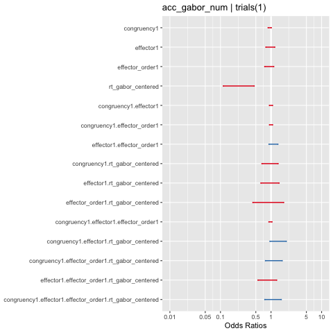
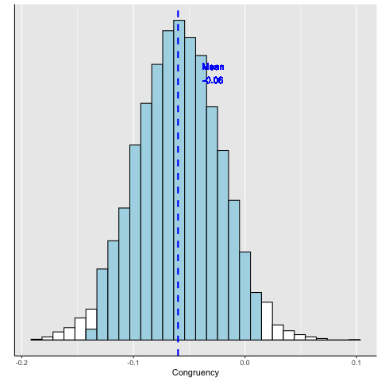
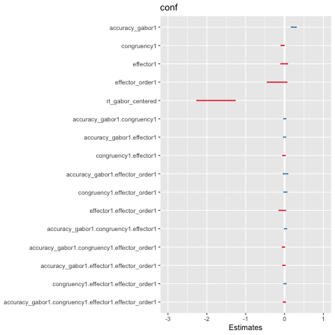
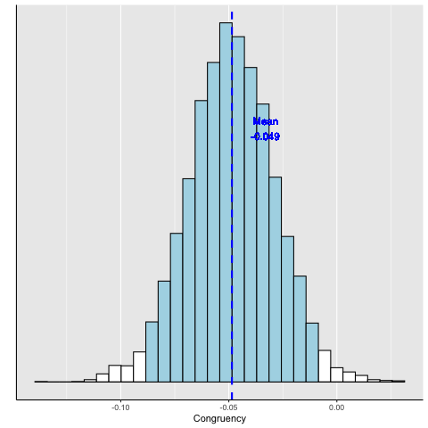
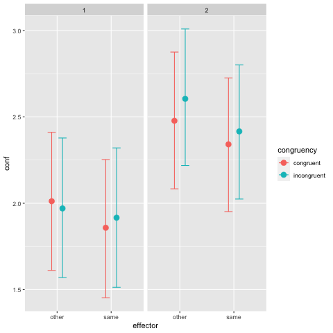

#+TITLE: MG2
#+DATE: 
#+AUTHOR: the author
#+EMAIL: the email
#+REVEAL_INIT_OPTIONS: width:1200, height:800, transition:'none'
#+REVEAL_ROOT: file:///Users/thibault/thib/reveal.js
#+OPTIONS: toc:1 reveal_single_file:t num:nil 
#+REVEAL_EXTRA_CSS: /Users/thibault/thib/reveal.js/local.css
#+REVEAL_THEME: simple 
# #+REVEAL_HLEVEL: 999 #minimum number of slides in first level
#+OPTIONS: author:nil date:nil email:nil
#+OPTIONS: timestamp:nil
#+OPTIONS: reveal_title_slide:auto 

:Options_R:
#+property: :session *R*
#+property: header-args:R :exports results
#+property: header-args:R :eval never-export
#+property: header-args:R+ :tangle yes
#+property: header-args:R+ :session
#+property: header-args:R+ :results output 
:end:

# clean output
#+begin_src emacs-lisp :exports none
   ;(org-babel-map-src-blocks nil (org-babel-remove-result))
#+end_src

* Preparation

First, a bit of data cleaning and contrasts definitions.

#+BEGIN_SRC R  :results none  :tangle yes  :session :exports code 
rm(list=ls(all=TRUE))  ## efface les données
source('~/thib/projects/tools/R_lib.r')
setwd('~/thib/projects/motor_gabor/data/MG2_data')
#setwd('C:/Users/remil/OneDrive/Documents/GitHub/motor_gabor/data/MG2_data')
#source('C:/Users/remil/OneDrive/Documents/GitHub/motor_gabor/data/MG2_data/R_lib.r')
#library('ggeffects')
load('data_final_MG2.rda')
data_complete <- data %>%
  mutate(block_10 = rep(sort(rep(1:10,40) , decreasing = FALSE),24)) %>%
  mutate(rt_gabor = ifelse(rt_gabor <0, NA, rt_gabor)) %>%
  mutate(rt_cue = ifelse(rt_cue <0, NA, rt_cue)) %>%
  mutate(accuracy_cue = ifelse(accuracy_cue <0, NA, accuracy_cue)) %>%
  mutate(accuracy_gabor = ifelse(accuracy_gabor <0, NA, accuracy_gabor)) %>%
  mutate(expected_gabor = ifelse(expected_gabor <0, NA, expected_gabor)) %>%
  mutate(pressed_gabor = ifelse(pressed_gabor <0, NA, pressed_gabor)) %>%
  mutate(gabor.contrast = ifelse(gabor.contrast <0, NA, gabor.contrast)) %>%
  mutate(pressed_cue = ifelse(pressed_cue =="-1", NA, pressed_cue)) %>%
  mutate(expected_cue = ifelse(expected_cue =="-1", NA, expected_cue)) %>%
  mutate(congruency = ifelse(congruency =="none", NA, congruency)) %>%
  mutate(effector_order = case_when(effector_order == 'other2' | effector_order == 'same1'  ~ 'same1',
                                    effector_order == 'same2' | effector_order == 'other1' ~ 'other1')) %>%
  select(-c(trial_start_time_rel2bloc, bloc_start_time_rel2exp, exp_start_date))

data_g <- data_complete %>%
    filter(!is.na(rt_gabor))

data <- data_g %>%
    filter(!grepl('WE', congruency)) %>% ## remove trials with wrong effector
    filter(conf > 0) ## remove detected errors

## define contrasts
data$acc_gabor_num <- data$accuracy_gabor ## on garde la variable 0/1 pour l'analyse de accuracy
data$accuracy_gabor <- as.factor(data$accuracy_gabor)
contrasts(data$accuracy_gabor) <- - contr.sum(2) ## erreur: -1; correct: 1
data$acc_cue_num <- data$accuracy_cue
data$effector <- as.factor(data$effector)
contrasts(data$effector) <-  -contr.sum(2) ## feet: -1; hand: 1
data$condition <- as.factor(data$condition)
data$effector_order <- as.factor(data$effector_order)
contrasts(data$effector_order) <-  contr.sum(2) ## hand1: -1; feet: 1
data$congruency <- as.factor(data$congruency)
contrasts(data$congruency) <-  contr.sum(2) ## incongruent: -1; congruent: 1
data$rt_gabor_centered <- data$rt_gabor - mean(data$rt_gabor, na.rm = TRUE)
#+END_SRC

* Accuracy

** Frequentist

Planned model.

#+BEGIN_SRC R  :results output   :exports both :tangle yes :session
   data$rt_gabor_centered <- data$rt_gabor - mean(data$rt_gabor, na.rm = TRUE) # center rt
   l.acc <- lmer_alt(acc_gabor_num ~  congruency * effector * effector_order  *  rt_gabor_centered +
		       (1 + congruency * effector + effector_order  +  rt_gabor_centered ||subject_id),
		     family = binomial(link = "logit"),
		     data = data)
  summary(l.acc)
#+END_SRC

#+BEGIN_SRC html
boundary (singular) fit: see ?isSingular
Generalized linear mixed model fit by maximum likelihood (Laplace Approximation) ['glmerMod']
 Family: binomial  ( logit )
Formula: acc_gabor_num ~ congruency * effector * effector_order * rt_gabor_centered +  
    (1 + re1.congruency1 + re1.effector1 + re1.effector_order1 +          re1.rt_gabor_centered + re1.congruency1_by_effector1 ||  
        subject_id)
   Data: data

     AIC      BIC   logLik deviance df.resid 
  5044.0   5185.1  -2500.0   5000.0     4488 

Scaled residuals: 
    Min      1Q  Median      3Q     Max 
-3.7740 -1.0541  0.4676  0.6345  1.8141 

Random effects:
 Groups       Name                         Variance Std.Dev.
 subject_id   (Intercept)                  0.09254  0.3042  
 subject_id.1 re1.congruency1              0.00000  0.0000  
 subject_id.2 re1.effector1                0.16655  0.4081  
 subject_id.3 re1.effector_order1          0.06105  0.2471  
 subject_id.4 re1.rt_gabor_centered        1.51737  1.2318  
 subject_id.5 re1.congruency1_by_effector1 0.00000  0.0000  
Number of obs: 4510, groups:  subject_id, 24

Fixed effects:
                                                         Estimate Std. Error z value Pr(>|z|)    
(Intercept)                                              1.117810   0.089480  12.492  < 2e-16 ***
congruency1                                             -0.059602   0.035751  -1.667   0.0955 .  
effector1                                               -0.036450   0.091211  -0.400   0.6894    
effector_order1                                         -0.083590   0.089218  -0.937   0.3488    
rt_gabor_centered                                       -1.647040   0.339696  -4.849 1.24e-06 ***
congruency1:effector1                                   -0.003459   0.035690  -0.097   0.9228    
congruency1:effector_order1                             -0.001456   0.035751  -0.041   0.9675    
effector1:effector_order1                                0.110207   0.091184   1.209   0.2268    
congruency1:rt_gabor_centered                           -0.030058   0.193334  -0.155   0.8765    
effector1:rt_gabor_centered                             -0.048593   0.220068  -0.221   0.8252    
effector_order1:rt_gabor_centered                       -0.128402   0.337912  -0.380   0.7040    
congruency1:effector1:effector_order1                   -0.026961   0.035697  -0.755   0.4501    
congruency1:effector1:rt_gabor_centered                  0.330171   0.192308   1.717   0.0860 .  
congruency1:effector_order1:rt_gabor_centered            0.126637   0.192885   0.657   0.5115    
effector1:effector_order1:rt_gabor_centered             -0.176417   0.220836  -0.799   0.4244    
congruency1:effector1:effector_order1:rt_gabor_centered  0.087899   0.192133   0.457   0.6473    
---
Signif. codes:  0 ‘***’ 0.001 ‘**’ 0.01 ‘*’ 0.05 ‘.’ 0.1 ‘ ’ 1

Correlation matrix not shown by default, as p =
12.
Use print(x, correlation=TRUE)  or
    vcov(x)        if you need it

optimizer (Nelder_Mead) convergence code: 0 (OK)
boundary (singular) fit: see ?isSingular
#+END_SRC

#+REVEAL: split

There is a convergence singularity issue. Let's look at PCA. 

#+BEGIN_SRC R  :results output   :exports both :tangle yes :session
  summary(rePCA(l.acc))
#+END_SRC

#+BEGIN_SRC html
: $subject_id
: Importance of components:
:                          [,1]    [,2]    [,3]    [,4] [,5] [,6]
: Standard deviation     1.2318 0.40811 0.30420 0.24707    0    0
: Proportion of Variance 0.8258 0.09064 0.05036 0.03322    0    0
: Cumulative Proportion  0.8258 0.91642 0.96678 1.00000    1    1
#+END_SRC

We remove congruency from the random effects structure.

#+REVEAL: split

#+BEGIN_SRC R  :results output   :exports both :tangle yes :session
l.acc2 <- lmer_alt(acc_gabor_num ~  congruency * effector * effector_order  *  rt_gabor_centered +
		    (1 + effector + effector_order  +  rt_gabor_centered ||subject_id),
		  family = binomial(link = "logit"),
		  data = data)
summary(l.acc2)
#+END_SRC

#+BEGIN_SRC html
Warning messages:
1: In checkConv(attr(opt, "derivs"), opt$par, ctrl = control$checkConv,  :
  unable to evaluate scaled gradient
2: In checkConv(attr(opt, "derivs"), opt$par, ctrl = control$checkConv,  :
  Model failed to converge: degenerate  Hessian with 1 negative eigenvalues
Generalized linear mixed model fit by maximum likelihood (Laplace Approximation) ['glmerMod']
 Family: binomial  ( logit )
Formula: acc_gabor_num ~ congruency * effector * effector_order * rt_gabor_centered +  
    (1 + re1.effector1 + re1.effector_order1 + re1.rt_gabor_centered ||          subject_id)
   Data: data

     AIC      BIC   logLik deviance df.resid 
  5040.0   5168.3  -2500.0   5000.0     4490 

Scaled residuals: 
    Min      1Q  Median      3Q     Max 
-3.7740 -1.0541  0.4676  0.6345  1.8141 

Random effects:
 Groups       Name                  Variance Std.Dev.
 subject_id   (Intercept)           0.06530  0.2555  
 subject_id.1 re1.effector1         0.16656  0.4081  
 subject_id.2 re1.effector_order1   0.08829  0.2971  
 subject_id.3 re1.rt_gabor_centered 1.51750  1.2319  
Number of obs: 4510, groups:  subject_id, 24

Fixed effects:
                                                         Estimate Std. Error z value Pr(>|z|)    
(Intercept)                                              1.117809   0.089480  12.492  < 2e-16 ***
congruency1                                             -0.059598   0.035751  -1.667   0.0955 .  
effector1                                               -0.036440   0.091213  -0.399   0.6895    
effector_order1                                         -0.083584   0.089218  -0.937   0.3488    
rt_gabor_centered                                       -1.646989   0.339699  -4.848 1.24e-06 ***
congruency1:effector1                                   -0.003461   0.035690  -0.097   0.9228    
congruency1:effector_order1                             -0.001451   0.035751  -0.041   0.9676    
effector1:effector_order1                                0.110207   0.091186   1.209   0.2268    
congruency1:rt_gabor_centered                           -0.030056   0.193340  -0.155   0.8765    
effector1:rt_gabor_centered                             -0.048580   0.220070  -0.221   0.8253    
effector_order1:rt_gabor_centered                       -0.128421   0.337917  -0.380   0.7039    
congruency1:effector1:effector_order1                   -0.026962   0.035697  -0.755   0.4501    
congruency1:effector1:rt_gabor_centered                  0.330120   0.192313   1.717   0.0861 .  
congruency1:effector_order1:rt_gabor_centered            0.126618   0.192889   0.656   0.5115    
effector1:effector_order1:rt_gabor_centered             -0.176444   0.220839  -0.799   0.4243    
congruency1:effector1:effector_order1:rt_gabor_centered  0.087953   0.192138   0.458   0.6471    
---
Signif. codes:  0 ‘***’ 0.001 ‘**’ 0.01 ‘*’ 0.05 ‘.’ 0.1 ‘ ’ 1

Correlation matrix not shown by default, as p =
12.
Use print(x, correlation=TRUE)  or
    vcov(x)        if you need it

optimizer (Nelder_Mead) convergence code: 0 (OK)
unable to evaluate scaled gradient
Model failed to converge: degenerate  Hessian with 1 negative eigenvalues
#+END_SRC

There is the expected RT effect, but no congruency effect.

** Bayesian

#+BEGIN_SRC R  :results none   :exports code :tangle yes :session
  ## fit_acc <- brm(acc_gabor_num | trials(1) ~  congruency * effector * effector_order  *  rt_gabor_centered +
  ##                (1 + congruency * effector + effector_order  +  rt_gabor_centered ||subject_id),
  ##                family = binomial(link = "logit"),
  ##            data = data,
  ##            prior = c(set_prior("normal(0,1)", class = "b")),
  ##            cores = 4, chains = 4,
  ##            control = list(adapt_delta = .95,  max_treedepth = 12),
  ##            iter = 4000,  warmup = 2000, seed = 123,  
  ##            save_model = 'acc.stan', 
  ##            save_pars = save_pars(all = TRUE)
  ##            )

  ## save(fit_acc, file ='fit_acc.rdata')
#+END_SRC

#+BEGIN_SRC R  :results output   :exports both :tangle yes :session
load('fit_acc.rdata') 
summary(fit_acc)
#+END_SRC

#+BEGIN_SRC html
 Family: binomial 
  Links: mu = logit 
Formula: acc_gabor_num | trials(1) ~ congruency * effector * effector_order * rt_gabor_centered + (1 + congruency * effector + effector_order + rt_gabor_centered || subject_id) 
   Data: data (Number of observations: 4510) 
Samples: 4 chains, each with iter = 4000; warmup = 2000; thin = 1;
         total post-warmup samples = 8000

Group-Level Effects: 
~subject_id (Number of levels: 24) 
                          Estimate Est.Error l-95% CI u-95% CI Rhat Bulk_ESS Tail_ESS
sd(Intercept)                 0.30      0.16     0.02     0.60 1.00      856     2197
sd(congruency1)               0.04      0.03     0.00     0.11 1.00     5144     3666
sd(effector1)                 0.46      0.09     0.32     0.66 1.00     2234     4355
sd(effector_order1)           0.30      0.16     0.02     0.60 1.01      871     2828
sd(rt_gabor_centered)         1.44      0.39     0.76     2.29 1.00     3279     4113
sd(congruency1:effector1)     0.04      0.03     0.00     0.11 1.00     5472     3701

Population-Level Effects: 
                                                        Estimate Est.Error l-95% CI u-95% CI Rhat Bulk_ESS Tail_ESS
Intercept                                                   1.13      0.11     0.92     1.34 1.00     4716     4317
congruency1                                                -0.06      0.04    -0.13     0.01 1.00    11521     6128
effector1                                                  -0.04      0.10    -0.24     0.17 1.00     2263     3495
effector_order1                                            -0.08      0.11    -0.29     0.12 1.00     5112     5323
rt_gabor_centered                                          -1.48      0.36    -2.17    -0.77 1.00     4387     5285
congruency1:effector1                                      -0.00      0.04    -0.08     0.07 1.00    13030     5927
congruency1:effector_order1                                -0.00      0.04    -0.07     0.07 1.00    11036     5932
effector1:effector_order1                                   0.11      0.10    -0.10     0.31 1.00     2351     3793
congruency1:rt_gabor_centered                              -0.05      0.19    -0.42     0.32 1.00    11836     6360
effector1:rt_gabor_centered                                -0.05      0.21    -0.46     0.37 1.00     9783     6599
effector_order1:rt_gabor_centered                          -0.14      0.36    -0.83     0.58 1.00     5005     5286
congruency1:effector1:effector_order1                      -0.03      0.04    -0.10     0.05 1.00    11569     5811
congruency1:effector1:rt_gabor_centered                     0.32      0.19    -0.05     0.70 1.00    11510     6414
congruency1:effector_order1:rt_gabor_centered               0.12      0.19    -0.26     0.51 1.00    12118     5855
effector1:effector_order1:rt_gabor_centered                -0.16      0.22    -0.60     0.26 1.00     9547     6666
congruency1:effector1:effector_order1:rt_gabor_centered     0.09      0.19    -0.29     0.47 1.00    12459     6265

Samples were drawn using sampling(NUTS). For each parameter, Bulk_ESS
and Tail_ESS are effective sample size measures, and Rhat is the potential
scale reduction factor on split chains (at convergence, Rhat = 1).
#+END_SRC

#+REVEAL: split

#+BEGIN_SRC R  :results output graphics :file acc_bayes.png :exports results 
  plot <- plot_model(fit_acc,ci.lvl = .95, size.inner = 0 ) 
  print(plot)
#+END_SRC

#+RESULTS:

#+REVEAL: split

Zoom on congruency.

#+BEGIN_SRC R  :results output graphics :file acc_bayes2.png :exports results 
  sample <- posterior_samples(fit_acc) %>%
       rename('congruency' = 'b_congruency1') %>%
       select(congruency)
  q.accuracy  <- post_plot(sample$congruency) + xlab('Congruency')
  plot(q.accuracy)
  unique(data$congruency)
#+END_SRC

#+RESULTS:

* Confidence

** Frequentist

Planned model.

#+BEGIN_SRC R  :results output   :exports both :tangle yes :session
l.conf <- lmer_alt(conf ~ accuracy_gabor  * congruency * effector * effector_order +  rt_gabor_centered +
		     (1 +  accuracy_gabor  + congruency * effector + effector_order + rt_gabor_centered||subject_id),
		   REML = TRUE,
		   data = data)

summary(l.conf)
#+END_SRC

#+BEGIN_SRC html
boundary (singular) fit: see ?isSingular
Linear mixed model fit by REML. t-tests use Satterthwaite's method ['lmerModLmerTest']
Formula: conf ~ accuracy_gabor * congruency * effector * effector_order +      rt_gabor_centered + (1 + re1.accuracy_gabor1 + re1.congruency1 +  
    re1.effector1 + re1.effector_order1 + re1.rt_gabor_centered +      re1.congruency1_by_effector1 || subject_id)
   Data: data

REML criterion at convergence: 11328.5

Scaled residuals: 
    Min      1Q  Median      3Q     Max 
-3.3254 -0.6412  0.0346  0.7116  3.6482 

Random effects:
 Groups       Name                         Variance Std.Dev.
 subject_id   (Intercept)                  0.245998 0.49598 
 subject_id.1 re1.accuracy_gabor1          0.014271 0.11946 
 subject_id.2 re1.congruency1              0.004089 0.06394 
 subject_id.3 re1.effector1                0.030939 0.17589 
 subject_id.4 re1.effector_order1          0.076411 0.27643 
 subject_id.5 re1.rt_gabor_centered        1.139401 1.06743 
 subject_id.6 re1.congruency1_by_effector1 0.000000 0.00000 
 Residual                                  0.669425 0.81818 
Number of obs: 4510, groups:  subject_id, 24

Fixed effects:
                                                        Estimate Std. Error         df t value Pr(>|t|)    
(Intercept)                                            2.388e+00  1.170e-01  2.209e+01  20.412 7.90e-16 ***
accuracy_gabor1                                        2.378e-01  2.849e-02  2.171e+01   8.349 3.19e-08 ***
congruency1                                           -4.884e-02  1.928e-02  2.732e+01  -2.533   0.0174 *  
effector1                                             -9.566e-03  3.883e-02  2.371e+01  -0.246   0.8075    
effector_order1                                       -1.917e-01  1.170e-01  2.209e+01  -1.638   0.1155    
rt_gabor_centered                                     -1.870e+00  2.337e-01  2.053e+01  -8.001 9.64e-08 ***
accuracy_gabor1:congruency1                            6.330e-03  1.416e-02  4.390e+03   0.447   0.6550    
accuracy_gabor1:effector1                              2.033e-03  1.469e-02  4.371e+03   0.138   0.8899    
congruency1:effector1                                 -1.531e-02  1.413e-02  4.430e+03  -1.084   0.2785    
accuracy_gabor1:effector_order1                        2.323e-02  2.848e-02  2.169e+01   0.816   0.4236    
congruency1:effector_order1                            2.037e-02  1.928e-02  2.731e+01   1.056   0.3001    
effector1:effector_order1                             -5.675e-02  3.883e-02  2.370e+01  -1.461   0.1570    
accuracy_gabor1:congruency1:effector1                  2.523e-02  1.418e-02  4.321e+03   1.779   0.0754 .  
accuracy_gabor1:congruency1:effector_order1           -2.880e-02  1.416e-02  4.390e+03  -2.034   0.0421 *  
accuracy_gabor1:effector1:effector_order1             -1.708e-02  1.469e-02  4.371e+03  -1.163   0.2450    
congruency1:effector1:effector_order1                  9.574e-03  1.413e-02  4.430e+03   0.678   0.4980    
accuracy_gabor1:congruency1:effector1:effector_order1 -5.687e-03  1.418e-02  4.321e+03  -0.401   0.6884    
---
Signif. codes:  0 ‘***’ 0.001 ‘**’ 0.01 ‘*’ 0.05 ‘.’ 0.1 ‘ ’ 1

Correlation matrix not shown by default, as p =
12.
Use print(x, correlation=TRUE)  or
    vcov(x)        if you need it

optimizer (nloptwrap) convergence code: 0 (OK)
boundary (singular) fit: see ?isSingular
#+END_SRC

#+REVEAL: split

There is a convergence singularity issue. Let's look at PCA. 

#+BEGIN_SRC R  :results output   :exports both :tangle yes :session
  summary(rePCA(l.conf))
#+END_SRC

#+RESULTS:
: $subject_id
: Importance of components:
:                         [,1]   [,2]    [,3]    [,4]    [,5]    [,6] [,7]
: Standard deviation     1.305 0.6062 0.33785 0.21498 0.14601 0.07815    0
: Proportion of Variance 0.754 0.1628 0.05057 0.02047 0.00944 0.00271    0
: Cumulative Proportion  0.754 0.9168 0.96738 0.98785 0.99729 1.00000    1

We remove congruency. 

#+REVEAL: split

#+BEGIN_SRC R  :results output   :exports both :tangle yes :session
l.conf2 <- lmer_alt(conf ~ accuracy_gabor  * congruency * effector * effector_order +  rt_gabor_centered +
		     (1 +  accuracy_gabor  +  effector + effector_order + rt_gabor_centered||subject_id),
		   REML = TRUE,
		   data = data)
summary(l.conf2)
#+END_SRC

#+BEGIN_SRC R
Warning message:
In checkConv(attr(opt, "derivs"), opt$par, ctrl = control$checkConv,  :
  Model failed to converge with max|grad| = 0.00602653 (tol = 0.002, component 1)
Linear mixed model fit by REML. t-tests use Satterthwaite's method ['lmerModLmerTest']
Formula: conf ~ accuracy_gabor * congruency * effector * effector_order +      rt_gabor_centered + (1 + re1.accuracy_gabor1 + re1.effector1 +  
    re1.effector_order1 + re1.rt_gabor_centered || subject_id)
   Data: data

REML criterion at convergence: 11335.8

Scaled residuals: 
    Min      1Q  Median      3Q     Max 
-3.3096 -0.6418  0.0291  0.7090  3.5165 

Random effects:
 Groups       Name                  Variance Std.Dev.
 subject_id   (Intercept)           0.007361 0.08579 
 subject_id.1 re1.accuracy_gabor1   0.014528 0.12053 
 subject_id.2 re1.effector1         0.031089 0.17632 
 subject_id.3 re1.effector_order1   0.314518 0.56082 
 subject_id.4 re1.rt_gabor_centered 1.138896 1.06719 
 Residual                           0.672988 0.82036 
Number of obs: 4510, groups:  subject_id, 24

Fixed effects:
                                                        Estimate Std. Error         df t value Pr(>|t|)    
(Intercept)                                            2.386e+00  1.169e-01  2.209e+01  20.411 7.95e-16 ***
accuracy_gabor1                                        2.386e-01  2.869e-02  2.175e+01   8.316 3.36e-08 ***
congruency1                                           -4.657e-02  1.419e-02  4.432e+03  -3.281  0.00104 ** 
effector1                                             -1.058e-02  3.892e-02  2.369e+01  -0.272  0.78812    
effector_order1                                       -1.916e-01  1.169e-01  2.209e+01  -1.639  0.11548    
rt_gabor_centered                                     -1.854e+00  2.336e-01  2.051e+01  -7.938 1.10e-07 ***
accuracy_gabor1:congruency1                            5.457e-03  1.411e-02  4.430e+03   0.387  0.69894    
accuracy_gabor1:effector1                              2.729e-03  1.472e-02  4.390e+03   0.185  0.85288    
congruency1:effector1                                 -1.546e-02  1.413e-02  4.430e+03  -1.094  0.27390    
accuracy_gabor1:effector_order1                        2.352e-02  2.868e-02  2.173e+01   0.820  0.42119    
congruency1:effector_order1                            1.911e-02  1.419e-02  4.434e+03   1.347  0.17818    
effector1:effector_order1                             -5.659e-02  3.892e-02  2.369e+01  -1.454  0.15910    
accuracy_gabor1:congruency1:effector1                  2.584e-02  1.409e-02  4.429e+03   1.833  0.06683 .  
accuracy_gabor1:congruency1:effector_order1           -2.761e-02  1.411e-02  4.430e+03  -1.957  0.05043 .  
accuracy_gabor1:effector1:effector_order1             -1.720e-02  1.472e-02  4.389e+03  -1.169  0.24262    
congruency1:effector1:effector_order1                  9.627e-03  1.413e-02  4.430e+03   0.681  0.49576    
accuracy_gabor1:congruency1:effector1:effector_order1 -6.261e-03  1.409e-02  4.429e+03  -0.444  0.65690    
---
Signif. codes:  0 ‘***’ 0.001 ‘**’ 0.01 ‘*’ 0.05 ‘.’ 0.1 ‘ ’ 1

Correlation matrix not shown by default, as p =
12.
Use print(x, correlation=TRUE)  or
    vcov(x)        if you need it

optimizer (nloptwrap) convergence code: 0 (OK)
Model failed to converge with max|grad| = 0.00602653 (tol = 0.002, component 1)
#+END_SRC

** Bayesian

#+BEGIN_SRC R  :results none   :exports code :tangle yes :session
  ## fit_conf <- brm(conf ~ accuracy_gabor  * congruency * effector * effector_order +  rt_gabor_centered +
  ## 		     (1 +  accuracy_gabor  + congruency * effector + effector_order + rt_gabor_centered||subject_id),
  ##            data = data,
  ##            prior = c(set_prior("normal(0,1)", class = "b")),
  ##            cores = 4, chains = 4,
  ##            control = list(adapt_delta = .95,  max_treedepth = 12),
  ##            iter = 4000,  warmup = 2000, seed = 123,  
  ##            save_model = 'conf.stan', 
  ##            save_pars = save_pars(all = TRUE)
  ##            )
  ## save(fit, file = 'conf.rdata')
#+END_SRC

#+BEGIN_SRC R  :results output   :exports both :tangle yes :session
load('fit_conf.rdata') 
summary(fit_conf)
#+END_SRC

#+BEGIN_SRC html
 Family: gaussian 
  Links: mu = identity; sigma = identity 
Formula: conf ~ accuracy_gabor * congruency * effector * effector_order + rt_gabor_centered + (1 + accuracy_gabor + congruency * effector + effector_order + rt_gabor_centered || subject_id) 
   Data: data (Number of observations: 4510) 
Samples: 4 chains, each with iter = 4000; warmup = 2000; thin = 1;
         total post-warmup samples = 8000

Group-Level Effects: 
~subject_id (Number of levels: 24) 
                          Estimate Est.Error l-95% CI u-95% CI Rhat Bulk_ESS Tail_ESS
sd(Intercept)                 0.40      0.21     0.02     0.77 1.00      870     2509
sd(accuracy_gabor1)           0.13      0.03     0.08     0.19 1.00     3304     5175
sd(congruency1)               0.07      0.02     0.03     0.11 1.00     2511     2577
sd(effector1)                 0.19      0.03     0.13     0.26 1.00     2775     4699
sd(effector_order1)           0.39      0.20     0.02     0.75 1.00      742     3068
sd(rt_gabor_centered)         1.13      0.21     0.77     1.61 1.00     2610     4570
sd(congruency1:effector1)     0.02      0.02     0.00     0.06 1.00     3711     4551

Population-Level Effects: 
                                                      Estimate Est.Error l-95% CI u-95% CI Rhat Bulk_ESS Tail_ESS
Intercept                                                 2.39      0.13     2.13     2.64 1.00     6641     5340
accuracy_gabor1                                           0.24      0.03     0.18     0.30 1.00     4278     5088
congruency1                                              -0.05      0.02    -0.09    -0.01 1.00     7171     6164
effector1                                                -0.01      0.04    -0.09     0.08 1.00     2619     3960
effector_order1                                          -0.19      0.13    -0.44     0.06 1.00     5877     5394
rt_gabor_centered                                        -1.77      0.25    -2.25    -1.28 1.00     2143     3551
accuracy_gabor1:congruency1                               0.01      0.01    -0.02     0.03 1.00    14045     6462
accuracy_gabor1:effector1                                 0.00      0.01    -0.03     0.03 1.00    15779     6114
congruency1:effector1                                    -0.02      0.02    -0.05     0.01 1.00    11643     6099
accuracy_gabor1:effector_order1                           0.02      0.03    -0.04     0.08 1.00     4405     5045
congruency1:effector_order1                               0.02      0.02    -0.02     0.06 1.00     7096     6641
effector1:effector_order1                                -0.06      0.04    -0.14     0.02 1.00     2863     4608
accuracy_gabor1:congruency1:effector1                     0.03      0.01    -0.00     0.05 1.00    14116     6626
accuracy_gabor1:congruency1:effector_order1              -0.03      0.01    -0.06    -0.00 1.00    15913     6128
accuracy_gabor1:effector1:effector_order1                -0.02      0.01    -0.05     0.01 1.00    13978     5943
congruency1:effector1:effector_order1                     0.01      0.02    -0.02     0.04 1.00    11008     6019
accuracy_gabor1:congruency1:effector1:effector_order1    -0.01      0.01    -0.03     0.02 1.00    14505     6694

Family Specific Parameters: 
      Estimate Est.Error l-95% CI u-95% CI Rhat Bulk_ESS Tail_ESS
sigma     0.82      0.01     0.80     0.84 1.00    15342     5376

Samples were drawn using sampling(NUTS). For each parameter, Bulk_ESS
and Tail_ESS are effective sample size measures, and Rhat is the potential
scale reduction factor on split chains (at convergence, Rhat = 1).
#+END_SRC

#+REVEAL: split

#+BEGIN_SRC R  :results output graphics :file conf_bayes.png :exports results 
  plot <- plot_model(fit_conf,ci.lvl = .95, size.inner = 0 ) 
  print(plot)
#+END_SRC

#+RESULTS:

#+REVEAL: split

Zoom on congruency.

#+BEGIN_SRC R  :results output graphics :file conf_bayes2.png :exports results 
  sample <- posterior_samples(fit_conf) %>%
       rename('congruency' = 'b_congruency1') %>%
       select(congruency)
  q.accuracy  <- post_plot(sample$congruency) + xlab('Congruency')
  plot(q.accuracy)
  unique(data$congruency)
#+END_SRC

#+RESULTS:

#+REVEAL: split

Zoom on congruency:effector:accuracy interaction.

#+BEGIN_SRC R  :results output graphics :file conf_bayes3.png :exports results 

conditions <- data.frame(accuracy_gabor = c(0, 1))
plot(conditional_effects(fit_conf, effects = 'effector:congruency',
                         conditions = conditions))
#+END_SRC

#+RESULTS:

